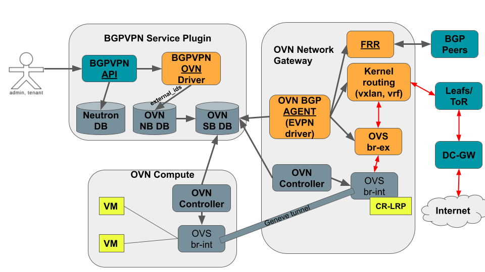
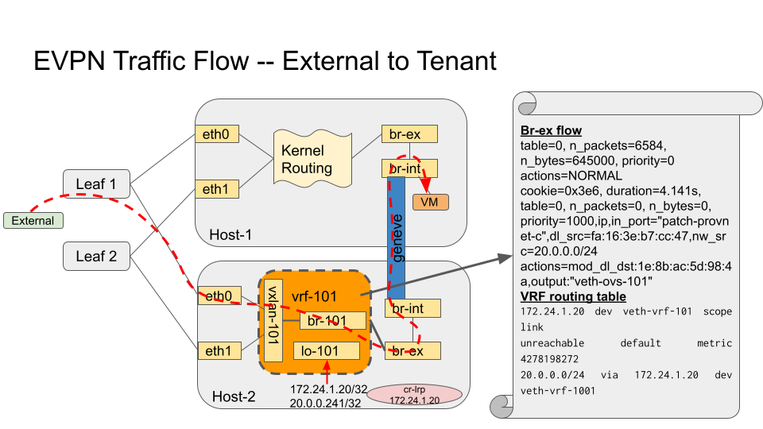

..
      This work is licensed under a Creative Commons Attribution 3.0 Unported
      License.

      http://creativecommons.org/licenses/by/3.0/legalcode

      Convention for heading levels in Neutron devref:
      =======  Heading 0 (reserved for the title in a document)
      -------  Heading 1
      ~~~~~~~  Heading 2
      +++++++  Heading 3
      '''''''  Heading 4
      (Avoid deeper levels because they do not render well.)

=========================================================
Design of OVN BGP Agent with EVPN Driver (kernel routing)
=========================================================

Purpose
-------

The purpose of this document is to present the design decision behind
the EVPN Driver for the Networking OVN BGP agent.

The main purpose of adding support for EVPN is to be able to provide
multitenancy aspects by using BGP in conjunction with EVPN/VXLAN. It allows
tenants to have connectivity between VMs running in different clouds,
with overlapping subnet CIDRs among tenants.

Overview
--------

The OVN BGP Agent is a Python based daemon that runs on each node
(e.g., OpenStack controllers and/or compute nodes). It connects to the OVN
Southbound DataBase (OVN SB DB) to detect the specific events it needs to
react to, and then leverages FRR to expose the routes towards the VMs, and
kernel networking capabilities to redirect the traffic once on the nodes to
the OVN overlay.

This simple design allows the agent to implement different drivers, depending
on what OVN SB DB events are being watched (watchers examples at
``ovn_bgp_agent/drivers/openstack/watchers/``), and what actions are
triggered in reaction to them (drivers examples at
``ovn_bgp_agent/drivers/openstack/XXXX_driver.py``, implementing the
``ovn_bgp_agent/drivers/driver_api.py``).

A new driver implements the support for EVPN capabilities with multitenancy
(overlapping CIDRs), by leveraging VRFs and EVPN Type-5 Routes. The API used
is the ``networking_bgpvpn`` upstream project, and a new watcher is created to
react to the information being added by it into the OVN SB DB (using the
``external-ids`` field).

Proposed Solution
-----------------

To support EVPN the functionality of the OVN BGP Agent needs
to be extended with a new driver that performs the extra steps
required for the EVPN configuration and steering the traffic to/from the node
from/to the OVN overlay. The only configuration needed is to enable the
specific driver on the ``bgp-agent.conf`` file.

This new driver will also require a new watcher to react to the EVPN-related
events. In this case, the EVPN events will be triggered by the addition of
EVPN/VNI information into the relevant OVN ``logical_switch_ports`` at the
OVN NB DB, which gets translated into external-ids at ``port_binding`` table
at the OVN SB DB.

This information is added into OVN DBs by the ``networking-bgpvpn`` projects.
The admin and user API to leverage the EVPN functionality is provided by
extending the ``networking-bgpvpn`` upstream project with a new service plugin
for ML2/OVN. This plugin will annotate the needed information regarding VNI
ids into the OVN DBs by using the ``external-ids`` field.

BGPVPN API
~~~~~~~~~~

To allow users to expose their tenant networks through EVPN, without worring
about overlapping CIDRs from other tenants, the ``networking-bgpvpn``
upstream project is leveraged as the API. It fits nicely as it has:

- An Admin API to define the BGPVPN properties, such as the VNI or the BGP AS
  to be used, and to associate it to a given tenant.

- A Tenant API to allow users to associate the BGPVPN to a router or to a
  network.

This provides an API that allows users to expose their tenant networks, and
admins to provide the needed EVPN/VNI information. Then, we need to enhance
``networking-bgpvpn`` with ML2/OVN support so that the provided information
is stored on the OVN SB DB and consumed by the new driver (when the
watcher detects it).

The overall arquitecture and integration between the ``networking-bgpvpn``
and the ``networking-bgp-ovn`` agent are shown in the next figure:

There are 3 main components:

- ``BGPVPN API``: This is the component that enables the association of RT/VNIs
  to tenant network/routers. It creates a couple of extra DBs on Neutron to
  keep the information. This is the component we leverage, restricting some
  of the APIs.

- ``OVN Service Plugin Driver``: (for ml2/ovs, the equivalent is the bagpipe
  driver) This is the component in charge of triggering the extra actions to
  notify the backend driver about the changes needed (RPCs for the ml2/ovs
  bagpipe driver). In our case it is a simple driver that just integrates with
  OVN (OVN NB DB) to ensure the information gets propagated to the
  corresponding OVN resource in the OVN Southbound database — by adding the
  information into the external_ids field. The Neutron ML2/OVN driver already
  copies the external_ids information of the ports from the
  ``Logical_Switch_Port`` table at the OVN NB DB into the ``Port_Binding``
  table at the OVN SB DB. Thus the new OVN service plugin driver only needs
  to annotate the relevant ports at the ``Logical_Switch_Port`` table with
  the required EVPN information (BGP AS number and VNI number) on the
  ``external_ids`` field. Then, it gets automatically translated into the
  OVN SB DB at the ``Port_Binding`` table, ``external_ids`` field, and
  the OVN BGP Agent can react to it.

- ``Backend driver``, i.e., the networking-bgp-ovn with the EVPN driver:
  (for ml2/ovs, the equivalent is the bagpipe-bgp project)
  This is the backend driver running on the nodes, in charge of configuring
  the networking layer based on the needs. In this case, the agent continues
  to consume information from the OVN SB DB (reading the extra information
  at external_ids, instead of relying on RPC as in the bagpipe-bgp case), and
  adds the needed kernel routing and FRR configuration, as well as OVS flows
  to steer the traffic to/from OVN overlay.

As regards to the API actions implemented, the user can:

- Associate the BGPVPN to a network:
  The OVN service plugin driver annotates the information into the
  ``external_ids`` field of the ``Logical_Switch_Port`` associated to the
  network router interface port (OVN patch port). Additionally, the router
  where the network is connected also gets the ``Logical_Switch_Port``
  associated to the router gateway port annotated (OVN patch port).

- Associate the BGPVPN to a router:
  The OVN service plugin driver performs the same actions as before, but
  annotating all the router interface ports connected to the router (i.e.,
  all the subnets attached to the router).

OVN SB DB Events
~~~~~~~~~~~~~~~~

The networking-bgp-ovn watcher that the EVPN driver uses need to detect the
relevant events on the OVN SB DB to call the driver functions to configure
EVPN.
When the VNI information is added/updated/delete to either a router gateway
port (patch port on the Port_Binding table) or a router interface port (also
a patch port on the Port_Binding table), it is clear that some actions need
to be trigger.
However there are other events that should be processed such as:

- VM creation on a exposed network/router

- Router exposed being attached/detached from the provider network

- Subnet exposed being attached/detached from the router

The EVPN watcher detects OVN SB DB events of ``RowEvent`` type at the
``Port_Binding`` table. It creates a new event class named
``PortBindingChassisEvent``, that all the rest extend.
The EVPN watcher reacts to the same type of events as the BGP watcher, but
with some differences. Also, it does not react to FIPs related events as
EVPN is only used for tenant networks.

The specific defined events to react to are:

- ``PortBindingChassisCreatedEvent`` (set gateway port for router):
  Detects when a port of type ``chassisredirect`` gets attached to the OVN
  chassis where the agent is running. This is the case for neutron gateway
  router ports (cr-lrps). It calls ``expose_ip`` driver method to decide if
  it needs to expose it through EVPN (in case it has related EVPN info
  annotated).

- ``PortBindingChassisDeletedEvent``  (unset gateway port for router):
  Detects when a port of type ``chassisredirect`` gets detached from the OVN
  chassis where teh agent is running. This is the case for neutron gateway
  router ports (cr-lrps). It calls ``withdraw_ip`` driver method to decide if
  it needs to withdraw the exposed EVPN route (in case it had EVPN info
  annotated).

- ``SubnetRouterAttachedEvent`` (add BGPVPN to router/network or attach
  subnet to router): Detects when a port of type ``patch`` gets
  created/updated with EVPN information (VNI and BGP_AS). These type of
  ports can be of 2 types:

  1) related to the router gateway port and therefore calling the
  ``expose_ip`` method, as in the ``PortBindingChassisCreateEvent``. The
  different is that in ``PortBindingChassisCreateEvent`` event the port was
  being created as a result of attaching the router to the provider network,
  while in the ``SubnetRouterAttachedEvent`` event the port was already there
  but information related to EVPN was added, i.e., the router was exposed by
  associating it a BGPVPN.

  2) related to the router interface port and therefore calling the
  ``expose_subnet`` method. This method will check if the associated gateway
  port is on the local chassis (where the agent runs) to proceed with the
  configuration steps to redirect the traffic to/from OVN overlay.

- ``SubnetRouterDetachedEvent`` (remove BGPVPN from router/network or detach
  subnet from router): Detects when a port of type ``patch`` gets either
  updated (removal of EVPN information) or directly deleted. The same 2 type
  of ports as in the previous event can be found, and the method
  ``withdraw_ip`` or ``withdraw_subnet`` are called for router gateway and
  router interface ports, respectively.

- ``TenantPortCreatedEvent`` (VM created):
  Detects when a port of type ``""`` or ``virtual`` gets updated (chassis
  added). It calls the method ``expose_remote_ip``. The method checks if
  the port is not on a provider network and the chassis where the agent is
  running has the gateway port for the router the VM is connected to.

- ``TenantPortDeletedEvent`` (VM deleted):
  Detects when a port of type ``""`` or ``virtual`` gets updated (chassis
  deleted) or deleted. It calls the method ``withdraw_remote_ip``. The method
  checks if the port is not on a provider network and the chassis where the
  agent is running has the gateway port for the router the VM is connected to.

Driver Logic
~~~~~~~~~~~~

The EVPN driver is in charge of the networking configuration ensuring that
VMs on tenant networks can be reached through EVPN (N/S traffic). To acomplish
this, it needs to ensure that:

- VM IPs can be advertized in a node where the traffic could be injected into
  OVN overlay, in this case the node where the router gateway port is
  scheduled (see limitations subsection).

- Once the traffic reaches the specific node, the traffic is redirected to the
  OVN overlay.

To do that it needs to:

1. Create the EVPN related devices when a router gets attached to the provider
   network and/or gets a BGPVPN assigned to it.

   - Create the VRF device, using the VNI number as the routing table number
     associated to it, as well as for the name suffix: vrf-1001 for vni 1001

     .. code-block:: ini

       ip link add vrf-1001 type vrf table 1001

   - Create the VXLAN device, using the VNI number as the vxlan id, as well as
     for the name suffix: vxlan-1001

     .. code-block:: ini

       ip link add vxlan-1001 type vxlan id 1001 dstport 4789 local LOOPBACK_IP nolearning

   - Create the Bridge device, where the vxlan device is connected, and
     associate it to the created vrf, also using the VNI number as name suffix:
     br-1001

     .. code-block:: ini

       ip link add name br-1001 type bridge stp_state 0
       ip link set br-1001 master vrf-1001
       ip link set vxlan-1001 master br-1001

   - Create a dummy device, where the IPs to be exposed will be added. It is
     associated to the created vrf, and also using the VNI number as name
     suffix: lo-1001

     .. code-block:: ini

       ip link add name lo-1001 type dummy
       ip link set lo-1001 master vrf-1001

   .. note::

      The VRF is not associated to an OpenStack tenant but to a router
      gateway ports, meaning that if a tenant has several Neutron routers
      connected to the provider network, it will have a different VRFs, one
      associated with each one of them.

2. Reconfigure local FRR instance (``frr.conf``) to ensure the new VRF is
   exposed. To do that it uses ``vtysh shell``. It connects to the existing
   FRR socket (--vty_socket option) and executes the next commands, passing
   them through a file (-c FILE_NAME option):

   .. code-block:: ini

        ADD_VRF_TEMPLATE = '''
        vrf {{ vrf_name }}
            vni {{ vni }}
        exit-vrf

        router bgp {{ bgp_as }} vrf {{ vrf_name }}
            address-family ipv4 unicast
              redistribute connected
            exit-address-family
            address-family ipv6 unicast
              redistribute connected
            exit-address-family
            address-family l2vpn evpn
              advertise ipv4 unicast
              advertise ipv6 unicast
            exit-address-family

        '''

3. Connect EVPN to OVN overlay so that traffic can be redirected from the node
   to the OVN virtual networking. It needs to connect the VRF to the OVS
   provider bridge:

   - Create veth device and attach one end to the OVS provider bridge, and the
     other to the vrf:

     .. code-block:: ini

        ip link add veth-vrf type veth peer name veth-ovs
        ovs-vsctl add-port br-ex veth-ovs
        ip link set veth-vrf master vrf-1001
        ip link set up dev veth-ovs
        ip link set up dev veth-vrf

   - Or the equivalent steps (vlan device) for the vlan provider network cases:

     .. code-block:: ini

        ovs-vsctl add-port br-vlan br-vlan-1001 tag=ID -- set interface br-vlan-1001 type=internal
        ip link set br-vlan-1001 up
        ip link set br-vlan-1001 master vrf-1001

   - Add route on the VRF routing table for both the router gateway port IP
     and the subnet CIDR so that the traffic is redirected to the OVS provider
     bridge (e.g., br-ex) through the veth/vlan device

     .. code-block:: ini

        $ ip route show vrf vrf-1001
        10.0.0.0/26 via 172.24.4.146 dev veth-vrf-1001|br-vlan-1001
        172.24.4.146 dev veth-vrf-1001|br-vlan-1001 scope link

4. Add needed OVS flows into the OVS provider bridge (e.g., br-ex) to redirect
   the traffic back from OVN to the proper VRF, based on the subnet CIDR and
   the router gateway port MAC address.

   .. code-block:: ini

      $ ovs-ofctl add-flow br-ex cookie=0x3e7,priority=1000,ip,in_port=1,dl_src:ROUTER_GATEWAY_PORT_MAC,nw_src=SUBNET_CIDR, actions=mod_dl_dst:VETH|VLAN_MAC,output=VETH|VLAN_PORT

5. Add IPs to expose to VRF associated dummy device. This interface is only
   used for the purpose of exposing the IPs, but not meant to receive the
   traffic. Thus, the local route being automatically added pointing to the
   dummy interface on the VRF for that (VM) IP is removed so that the traffic
   can get redirected properly to the OVN overlay.

   .. code-block:: ini

        $ ip addr add 10.0.0.5/32 dev lo-1001
        $ ip route show vrf table 1001 | grep local
        10.0.0.5 dev lo-1001
        $ ip route delete local 10.0.0.5 dev 1001 table 1001

Driver API
++++++++++

The EVPN driver needs to implement the ``driver_api.py`` interface.
It implements the next functions:

- ``expose_ip``: Creates all the VRF/VXLAN configuration (devices and its
  connection to the OVN overlay) as well as the VRF configuration at FRR
  (steps 1 to 3). It also checks if there are subnets and VMs connected to
  the OVN gateway router port that must be exposed through EVPN (steps 4-5).

- ``withdraw_ip``: removes the above configuration (devices and FRR
  configuration).

- ``expose_subnet``: add kernel and ovs networking configuration to ensure
  traffic can go from the node to the OVN overlay, and viceversa, for IPs
  within the subnet CIDR and on the right VRF -- step 4.

- ``withdraw_subnet``: removes the above kernel and ovs networking
  configuration.

- ``expose_remote_ip``: EVPN expose VM tenant network IPs through the chassis
  hosting the OVN gateway port for the router where the VM is connected.
  It ensures traffic destinated to the VM IP arrives to this node (step 5).
  The previous steps ensure the traffic is redirected to the OVN overlay
  once on the node.

- ``withdraw_remote_ip``: EVPN withdraw VM tenant network IPs through the
  chassis hosting the OVN gateway port for the router where the VM is
  connected. It ensures traffic destinated to the VM IP stops arriving to
  this node.

Traffic flow
~~~~~~~~~~~~

The next figure shows the N/S traffic flow through the VRF to the VM,
including information regarding the OVS flows on the provider bridge (br-ex),
and the routes on the VRF routing table.

The IPs of both the router gateway port (cr-lrp, 172.24.1.20), as well as the
IP of the VM itself (20.0.0.241/32) gets added to the dummy device (lo-101)
associated to the vrf (vrf-101) which was used for defining the BGPVPN
(vni 101). That together with the other devices created on the VRF (vxlan-101
and br-101), and with the FRR reconfiguration ensure the IPs get exposed in
the right EVPN. This allows the traffic to reach the node with the router
gateway port (cr-lrp on OVN).

However this is not enough as the traffic needs to be redirected to the OVN
Overlay. To do that the VRF is added to the br-ex OVS provider bridge (br-ex),
and two routes are added to the VRF routing table to redirect the traffic
going to the network (20.0.0.0/24) through the cr-lrp port to the br-ex OVS
bridge.
That injects the traffic properly into the OVN overlay, which will redirect
it through the geneve tunnel (by the br-int ovs flows) to the compute node
hosting the VM. The reply from the VM will come back through the same tunnel.
However an extra OVS flow needs to be added to the OVS provider bridge (br-ex)
to ensure the traffic is redirected back to the VRF (vrf-101) if the traffic
is coming from the exposed network (20.0.0.0/24) -- instead of using the
default routing table (action=NORMAL). To that end, the next rule is added:

.. code-block:: ini

   cookie=0x3e6, duration=4.141s, table=0, n_packets=0, n_bytes=0, priority=1000,ip,in_port="patch-provnet-c",dl_src=fa:16:3e:b7:cc:47,nw_src=20.0.0.0/24 actions=mod_dl_dst:1e:8b:ac:5d:98:4a,output:"veth-ovs-101"

It matches the traffic coming from the router gateway port (cr-lrp port) from
br-int (in_port="patch-provnet-c"), with the MAC address of the router gateway
port (dl_src=fa:16:3e:b7:cc:47) and from the exposed network (nw_src=20.0.0.0/24).
For that case it changes the MAC by the veth-vrf-101 device one
(mod_dl_dst:1e:8b:ac:5d:98:4a), and redirect the traffic to the vrf device
through the veth/vlan device (output:"veth-ovs-101").

Agent deployment
~~~~~~~~~~~~~~~~

The EVPN mode exposes the VMs on tenant networks (on their respective
EVPN/VXLAN). At OpenStack, with OVN networking, the N/S traffic to the
tenant VMs (without FIPs) needs to go through the networking nodes, more
specifically the one hosting the chassisredirect OVN port (cr-lrp), connecting
the provider network to the OVN virtual router. As a result, there is no need
to deploy the agent in all the nodes. Only the nodes that are able to host
router gateway ports (cr-lrps), i.e., the ones tagged with the
``enable-chassis-gw``. Hence, the VM IPs are advertised through BGP/EVPN in
one of those nodes, and from there it follows the normal path to the OpenStack
compute node where the VM is allocated — the Geneve tunnel.

Limitations
-----------

The following limitations apply:

- Network traffic is steer by kernel routing (VRF, VXLAN, Bridges), therefore
  DPDK, where the kernel space is skipped, is not supported

- Network traffic is steer by kernel routing (VRF, VXLAN, Bridges), therefore
  SRIOV, where the hypervisor is skipped, is not supported.

- In OpenStack with OVN networking the N/S traffic to the tenant VMs (without
  FIPs) needs to go through the networking nodes (the ones hosting the Neutron
  Router Gateway Ports, i.e., the chassisredirect cr-lrp ports). Therefore, the
  entry point into the OVN overlay need to be one of those networking nodes,
  and consequently the VMs are exposed through them. From those nodes the
  traffic will follow the normal tunneled path (Geneve tunnel) to the OpenStack
  compute node where the VM is allocated.
