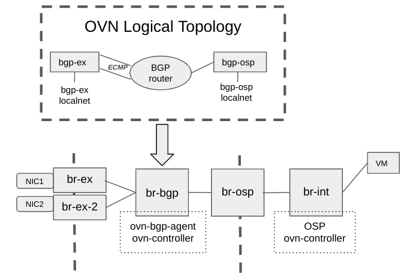

.. _ovn_routing:

===================================================================
[NB DB] NB OVN BGP Agent: Design of the BGP Driver with OVN routing
===================================================================

This is an extension of the NB OVN BGP Driver which adds a new
``exposing_method`` named ``ovn`` to make use of OVN routing, instead of
relying on Kernel routing.

Purpose
-------

This document presents the design decision behind the extensions on the
NB OVN BGP Driver to support OVN routing instead of kernel routing,
and therefore enabling datapath acceleartion.

Overview
--------

The main goal is to make the BGP capabilities of OVN BGP Agent compliant with
OVS-DPDK and HWOL. To do that we need to move to OVN/OVS what the OVN BGP
Agent is currently doing with Kernel networking -- redirect traffic to/from
the OpenStack OVN Overlay.

To accomplish this goal, the following is required:

- Ensure that incoming traffic gets redirected from the physical NICs to the OVS
  integration bridge (br-int) though one or more OVS provider bridges (br-ex)
  without using kernel routes and rules.

- Ensure the outgoing traffic gets redirected to the physical NICs without
  using the default kernel routes.

- Expose the IPs in the same way as we did before.

The third point is simple as it is already being done, but for the first two
points OVN virtual routing capabilities are needed, ensuring the traffic gets
routed from the NICS to the OpenStack Overlay and vice versa.

Proposed Solution
-----------------

To avoid placing kernel networking in the middle of the datapath and blocking
acceleration, the proposed solution mandates locating a separate OVN cluster
on each node that manages the needed virtual infrastructure between the
OpenStack networking overlay and the physical network.
Because routing occurs at OVN/OVS level, this proposal makes it is possible
to support hardware offloading (HWOL) and OVS-DPDK.

The next figure shows the proposed cluster required to manage the OVN virtual
networking infrastructure on each node.

In a standard deployment ``br-int`` is directly connected to the OVS external
bridge (``br-ex``) where the physical NICs are attached.
By contrast, in the default BGP driver solution (see :ref:`nb_bgp_driver`),
the physical NICs are not directly attached to br-ex, but rely on kernel
networking (ip routes and ip rules) to redirect the traffic to ``br-ex``.
The OVN routing architecture proposes the following mapping:

- ``br-int`` connects to an external (from the OpenStack perspective) OVS bridge
  (``br-osp``).

- ``br-osp`` does not have any physical resources attached, just patch
  ports connecting them to ``br-int`` and ``br-bgp``.

- ``br-bgp`` is the integration bridge managed by the extra OVN cluster
  deployed per node. This is where the virtual OVN resources are be created
  (routers and switches). It creates mappings to ``br-osp`` and ``br-ex``
  (patch ports).

- ``br-ex`` keeps being the external bridge, where the physical NICs are
  attached (as in default environments without BGP). But instead of being
  directly connected to ``br-int``, is connected to ``br-bgp``. Note for
  ECMP purposes, each nic is attached to a different ``br-ex`` device
  (``br-ex`` and ``br-ex-2``).

The virtual OVN resources requires the following:

- Logical Router (``bgp-router``): manages the routing that was
  previously done in the kernel networking layer between both networks
  (physical and OpenStack OVN overlay). It has two connections (i.e., Logical
  Router Ports) towards the ``bgp-ex-X`` Logical Switches to add support for ECMP
  (only one switch is required but you must have several in case of ECMP),
  and one connection to the ``bgp-osp`` Logical Switch to ensure traffic
  to/from the OpenStack networking overlay.

- Logical Switch (``bgp-ex``): is connected to the ``bgp-router``, and has
  a localnet to connect it to ``br-ex`` and therefore the physical NICs. There
  is one Logical Switch per NIC (``bgp-ex`` and ``bgp-ex-2``).

- Logical Switch (``bgp-osp``): is connected to the ``bgp-router``, and has
  a localnet to connect it to ``br-osp`` to enable it to send traffic to
  and from the OpenStack OVN overlay.

The following OVS flows are required on both OVS bridges:

- ``br-ex-X`` bridges: require a flow to ensure only the traffic
  targetted for OpenStack provider networks is redirected to the OVN cluster.

    .. code-block:: ini

      cookie=0x3e7, duration=942003.114s, table=0, n_packets=1825, n_bytes=178850, priority=1000,ip,in_port=eth1,nw_dst=172.16.0.0/16 actions=mod_dl_dst:52:54:00:30:93:ea,output:"patch-bgp-ex-lo"

- ``br-osp`` bridge: require a flow for each OpenStack provider network to
  change the MAC by the one on the router port in the OVN cluster and to
  properly manage traffic that is routed to the OVN cluster.

    .. code-block:: ini

      cookie=0x3e7, duration=942011.971s, table=0, n_packets=8644, n_bytes=767152, priority=1000,ip,in_port="patch-provnet-0" actions=mod_dl_dst:40:44:00:00:00:06,NORMAL

OVN NB DB Events
~~~~~~~~~~~~~~~~

The OVN northbound database events that the driver monitors are the same as
the ones for the NB DB driver with the ``underlay`` exposing mode.
See :ref:`nb_bgp_driver`. The main difference between the two drivers is
that the wiring actions are simplified for the OVN routing driver.

Driver Logic
~~~~~~~~~~~~

As with the other BGP drivers or ``exposing modes`` (:ref:`bgp_driver`,
:ref:`nb_bgp_driver`) the NB DB Driver with the ``ovn`` exposing mode enabled
(i.e., enabling ``OVN routing`` instead of rely on ``Kernel networking``)
is in charge of exposing the IPs with BGP and of the networking configuration
to ensure that VMs abd LBs on provider networks or with FIPs can be reached
through BGP (N/S traffic). Similarly, if ``expose_tenant_networks`` flag is
enabled, VMs in tenant networks should be reachable too -- although instead
of directly in the node they are created, through one of the network gateway
chassis nodes. The same happens with ``expose_ipv6_gua_tenant_networks``
but only for IPv6 GUA ranges.
In addition, if the config option ``address_scopes`` is set only the tenant
networks with matching corresponding address_scope will be exposed.

To accomplish this, it needs to configure the extra per node ovn cluster to
ensure that:

- VM and LBs IPs can be advertized in a node where the traffic could be injected
  into the OVN overlay through the extra ovn cluster (instead of the Kernel
  routing) -- either in the node hosting the VM or the node where the router
  gateway port is scheduled.

- Once the traffic reaches the specific node, the traffic is redirected to the
  OVN overlay by using the extra ovn cluster per node with the proper OVN
  configuration. To do this it needs to create Logical Switches, Logical
  Routers and the routing configuration between them (routes and policies).

.. include:: ../bgp_advertising.rst

Traffic Redirection to/from OVN
+++++++++++++++++++++++++++++++

As explained before, the main idea of this exposing mode is to leverage OVN
routing instead of kernel routing. For the traffic going out the steps are
the next:

- If (OpenStack) OVN cluster knows about the destination MAC then that works
  as in deployment without BGP or OVN cluster support (no arp needed, MAC
  directly used). If the MAC is unknown but on the same provider network(s)
  range, the ARP gets replied by the Logical Switch Port on the ``bgp-osp`` LS
  thanks to enabling arp_proxy on it. And if it is a different range, it will
  reply due to the router having default routes to the outside.
  The flow at ``br-osp`` is in charge of changing the destination MAC by the
  one on the Logical Router Port on ``bgp-router`` LR.

- The previous step takes the traffic to the extra OVN cluster per node, where
  the default (ECMP) routes are used to send the traffic to the external
  Logical Switch and from there to the physical nics attached to the external
  OVS bridge(s) (``br-ex``, ``br-ex-2``). In case of known MAC by OpenStack,
  instead of the default routes, a Logical Route Policy gets applied so that
  traffic is forced to be redirected out (through the LRPs connected to the
  external LS) when comming through the internal LRP (the one connected to
  OpenStack).

And for the traffic comming in:

- The flow hits the ovs flow added at the ``br-ex-X`` bridge(s) to redirect
  the traffic to the per node OVN cluster, changing the destination MAC by
  the one at the related ``br-ex`` device, which are the same used for the
  OVN cluster Logical Router Ports. This takes the traffic to the OVN router.

- After that, thanks to having the arp_proxy enabled on the LSP on ``bgp-osp``
  the traffic will be redirected to there. And due to a limitation in the
  functionality of arp_proxy, there is a need of adding an extra static mac
  binding entry in the cluster so that the VM MAC is used for destination
  instead of the own LSP MAC, which would lead to droping the traffic on the
  LS pipeline.

  .. code-block:: ini

    _uuid               : 6e1626b3-832c-4ee6-9311-69ebc15cb14d
    ip                  : "172.16.201.219"
    logical_port        : bgp-router-openstack
    mac                 : "fa:16:3e:82:ee:19"
    override_dynamic_mac: true

Driver API
++++++++++

This is the very same as in the NB DB driver with the ``underlay`` exposing
mode. See :ref:`nb_bgp_driver`.

Agent deployment
~~~~~~~~~~~~~~~~
The deployment is similar to the NB DB driver with the ``underlay`` exposing
method but with some extra configuration. See :ref:`nb_bgp_driver` for the base.

It is needed to state the exposing method in the DEFAULT section and the extra
configuration for the local ovn cluster that performs the routing, including the
range for the provider networks to expose/handle:

  .. code-block:: ini

    [DEFAULT]
    exposing_method=ovn

    [local_ovn_cluster]
    ovn_nb_connection=unix:/run/ovn/ovnnb_db.sock
    ovn_sb_connection=unix:/run/ovn/ovnsb_db.sock
    external_nics=eth1,eth2
    peer_ips=100.64.1.5,100.65.1.5
    provider_networks_pool_prefixes=172.16.0.0/16

Limitations
-----------

The following limitations apply:

- OVN 23.06 or later is required

- Tenant networks, subnet and OVN load balancers are not yet supported, and
  will require OVN vesion 23.09 or newer.

- IPv6 not yet supported

- ECMP not properly working as there is no support for BFD at the ovn-cluster,
  which means if one of the routes goes away the OVN cluster won't react to it
  and there will be traffic disruption.

- There is no support for overlapping CIDRs, so this must be avoided, e.g., by
  using address scopes and subnet pools.
